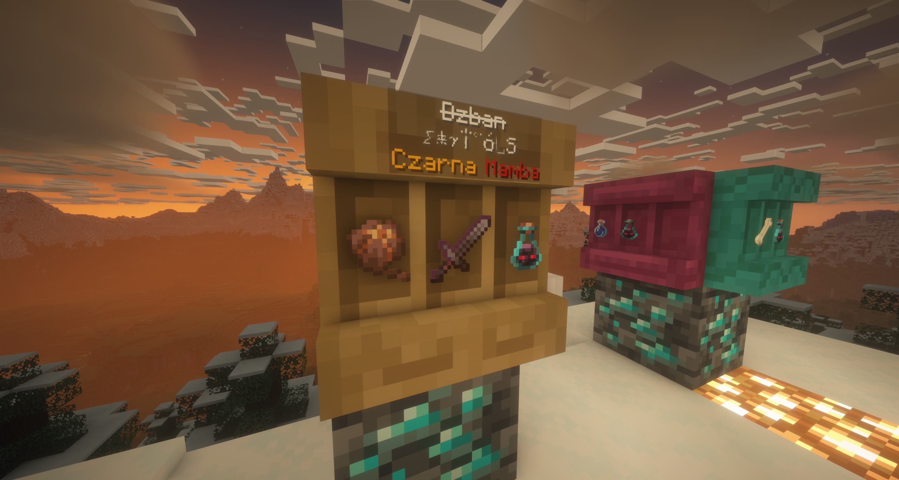

[English](README.md) · **Polski**

# ShelfNames

Lekki plugin do Minecraft (Paper), który wyświetla **nazwy itemów znajdujących się na półkach** (`*_SHELF`) w formie **hologramu nad blokiem**, gdy gracz na niego patrzy.

Plugin został zaprojektowany z naciskiem na **wydajność**, **brak zbędnych alokacji** oraz **minimalny wpływ na server thread**.



---

## ✨ Funkcje

- Wyświetlanie nazw itemów z półki jako hologram
- Obsługa wszystkich wariantów drewnianych półek (`Tag.WOODEN_SHELVES`)
- Zachowanie kolorów i formatowania nazw itemów
- Aktualizacja hologramu tylko przy realnej zmianie zawartości
- Automatyczne usuwanie hologramu po odejściu wzroku
- Brak migotania i zbędnych aktualizacji
- W pełni kompatybilny z Adventure / MiniMessage

---

## ⚙️ Jak działa

- Co określoną liczbę ticków plugin sprawdza, **na jaki blok patrzy gracz**
- Jeśli jest to półka:
    - porównywana jest jej pozycja z poprzednią (cache)
    - snapshot zawartości tworzony jest **tylko przy zmianie oglądanej półki**
- Hologram aktualizowany jest **tylko** po zmianie oglądanej półki 
- Kosztowne operacje (`BlockState`) wykonywane są **wyłącznie wtedy, gdy są potrzebne**

---

## 🔧 Konfiguracja

Wersja PL komentarzy w pliku konfiguracyjnym: [`docs/config.pl.yml`](docs/config.pl.yml).

```yaml
# Co ile ticków sprawdzać czy gracz patrzy się na półkę
update-interval-ticks: 5
# Maksymalny dystans w jakim musi być półka od gracza
rayTraceBlocks-max-distance: 5
# Czy pokazywać niestandardowe nazwy itemów
only-custom-names: true
# Czy pokazywać hologramy tylko dla jednego gracza
only-one-player: true

hologram:
  # Opcje:
  # - AUTO (automatyczny wybór w kolejności jak poniżej, ostatecznie STANDALONE)
  # - FANCY (FancyHolograms)
  # - STANDALONE (API Bukkit/PaperMC)
  provider: AUTO
  # Czy hologram ma podążać za wzrokiem gracza,
  #  czy sztywno skierowany wraz z frontem półki?
  position-fixed: true
  # przesunięcie wysokości
  offset-y: 0.75
  # Odsunięcie od półki
  forward-offset: -0.16
  # Skalowanie obiektu hologramu
  scale: 0.32

# Konfiguracja hologramu zależnie od użytej integracji
integration:
  fancyHolograms:
    # Cienie za tekstem
    textShadow: true
    # Wyrównanie tekstu
    # Dostępne opcje: LEFT, CENTER, RIGHT
    textAlignment: CENTER
    # Czy hologram ma używać domyślnego tła
    defaultBackground: true
    # ...jeśli nie to ustawiamy wartości 0-255
    backgroundARGB:
      alpha: 60
      red: 0
      green: 0
      blue: 0

  # API Bukkit
  standalone:
    # Cienie za tekstem (TextDisplay#setShadowed)
    textShadow: true
    # Wyrównanie tekstu
    # Dostępne opcje: LEFT, CENTER, RIGHT
    textAlignment: CENTER
    # Czy hologram ma używać domyślnego tła
    defaultBackground: false
    # ...jeśli nie, to ustawiamy wartości 0–255
    backgroundARGB:
      alpha: 60
      red: 0
      green: 0
      blue: 0

```

---

## 🎮 Komendy i uprawnienia

| Komenda | Uprawnienie | Opis |
|---|---|---|
| `/shelfnames` (lub `/shelfnames info`) | *(brak)* | Informacje o pluginie: nazwa, wersja, link do GitHuba |
| `/shelfnames clear` | `shelfnames.admin` | Usuwa wszystkie hologramy utworzone przez plugin |
| `/shelfnames reload` | `shelfnames.admin` | Pełny restart: kasuje hologramy, wczytuje `config.yml`, uruchamia komponenty od nowa |

Gracz bez `shelfnames.admin` może wykonać wyłącznie samą komendę `/shelfnames` (informacyjną).
`shelfnames.admin` domyślnie przysługuje OP.

---

## 📦 Wymagania

- Paper 1.21+
- FancyHolograms 2.8.0+
- Java 21

##🧩 Zależności

- [FancyHolograms](https://modrinth.com/plugin/fancyholograms)
- Paper API
- Adventure (wbudowane w Paper)

## 🚀 Planowane funkcje

- Opcjonalne wygładzanie przejść (fade in / fade out)

## 🚫 Niewspierane integracje

### DecentHolograms

[DecentHolograms](https://www.spigotmc.org/resources/decentholograms-1-8-1-21-11-papi-support-no-dependencies.96927/)
**nie jest wspierany** — jego publiczne API nie udostępnia przypięcia hologramu
(billboard `FIXED`), skalowania ani tła, więc integracji nie da się zrealizować tak
jak dla FancyHolograms czy API Bukkit. Zamiennik bez zależności: provider `STANDALONE`
(Bukkit `TextDisplay`), który honoruje `hologram.scale` i `hologram.position-fixed`.

## 🧠 Uwagi techniczne

Plugin nie używa NMS, nie wysyła własnych pakietów i nie ingeruje w tick loop serwera.

Został zoptymalizowany przy użyciu Spark Profiler i testowany pod kątem realnego obciążenia.
